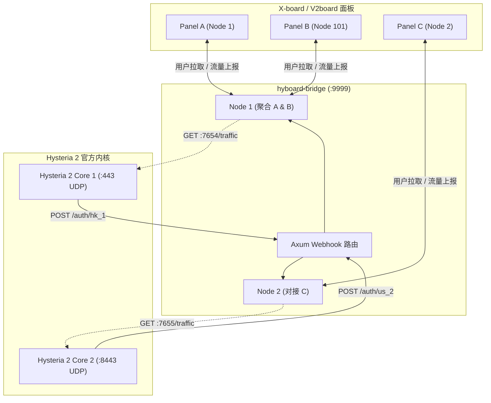

<div align="center">
  <h1>hyboard-bridge</h1>
  <p><strong>X-board / V2board to Hysteria 2 Native Core Authentication Bridge</strong></p>
  
  
  
  
  
  
</div>

---

## 概述 (Overview)

`hyboard-bridge` 是一款专为 **X-board / V2board** 与 **Hysteria 2 官方内核 (v2.12+)** 设计的高性能桥接守护程序。

通过在服务器本地开放 HTTP Webhook 鉴权接口并定期轮询 `trafficStats` 接口，它为官方 Hysteria 2 节点提供微秒级的鉴权响应与精准的流量上报，支持复杂多节点与跨面板聚合架构。

---

## 核心特性 (Features)

- **微秒级本地鉴权**：在本地提供 `POST /auth` Webhook 鉴权，响应时间 < 1ms。
- **离线容灾机制**：鉴权白名单驻留内存，面板短暂离线不影响现存用户连接与新连接握手。
- **持久化流量上报**：网络异常期间自动累积用户流量，连接恢复后自动补报，确保计费精准。
- **多节点聚合支持**：支持单一 Hysteria 2 进程同时为多个面板、多个节点提供鉴权，白名单自动聚合。
- **极低资源开销**：基于 Rust 与 Tokio 运行时，二进制包大小 < 15MB，静态内存占用 < 10MB。

---

## 架构说明 (Architecture)



---

## 配置参考 (`config.toml`)

默认配置文件路径：`./config.toml`。也可通过环境变量 `CONFIG_FILE` 指定。

```toml
[global]
listen_port = 9999              # 本地鉴权 Webhook 监听端口
rust_log = "info"               # 日志等级 (debug, info, warn, error)

# 配置组 1: 多面板聚合共享同一 Hysteria 2 实例 (端口 7654)
[[nodes]]
tag = "hk_panel_a"                              # Webhook 路由: /auth/hk_panel_a
api_host = "https://xboard-a.example.com"
api_key = "token_for_panel_a"
node_id = 1
hysteria_base_url = "http://127.0.0.1:7654"     # Hysteria 2 流量统计接口
sync_interval = 15                              # 白名单同步间隔(秒)
push_interval = 60                              # 流量上报间隔(秒)

[[nodes]]
tag = "hk_panel_b"                              # Webhook 路由: /auth/hk_panel_b
api_host = "https://xboard-b.example.com"
api_key = "token_for_panel_b"
node_id = 101
hysteria_base_url = "http://127.0.0.1:7654"     
sync_interval = 15
push_interval = 60

# 配置组 2: 独立 Hysteria 2 实例 (端口 7655)
[[nodes]]
tag = "us_node"                                 # Webhook 路由: /auth/us_node
api_host = "https://xboard-a.example.com"
api_key = "token_for_panel_a"
node_id = 2
hysteria_base_url = "http://127.0.0.1:7655"
sync_interval = 15
push_interval = 60
```

---

## 部署说明 (Deployment)

### 1. 编译安装
```bash
# 1. 安装 Rust 工具链
curl --proto '=https' --tlsv1.2 -sSf https://sh.rustup.rs | sh

# 2. 编译项目
git clone https://github.com/aquamarine-z/hyboard-bridge.git
cd hyboard-bridge
cargo build --release

# 3. 安装执行文件与配置
cp target/release/hyboard-bridge /usr/local/bin/
chmod +x /usr/local/bin/hyboard-bridge
mkdir -p /opt/hyboard-bridge
cp config.example.toml /opt/hyboard-bridge/config.toml
```

### 2. Systemd 配置
创建 `/etc/systemd/system/hyboard-bridge.service`：
```ini
[Unit]
Description=hyboard-bridge Daemon
After=network.target network-online.target
Wants=network-online.target

[Service]
Type=simple
WorkingDirectory=/opt/hyboard-bridge
ExecStart=/usr/local/bin/hyboard-bridge
Restart=always
RestartSec=3s
LimitNOFILE=65535

[Install]
WantedBy=multi-user.target
```
```bash
systemctl daemon-reload
systemctl enable --now hyboard-bridge
```

---

## 故障排查 (Troubleshooting)

### 1. TOML 解析异常 (`TOML parse error`)
- **错误信息**：`expected newline, #`
- **原因**：TOML 格式规范要求字符串必须包含引号。
- **解决**：确保 `rust_log = "info"` 包含双引号。

### 2. Systemd 启动失败 (`status=203/EXEC`)
- **原因**：二进制文件路径错误或无执行权限。
- **解决**：检查 `/usr/local/bin/hyboard-bridge` 路径准确性并执行 `chmod +x`。

### 3. 端口冲突 (`bind: address already in use`)
- **原因**：UDP 连接端口被其他服务（如旧版 Docker Hysteria、XrayR 等）占用。
- **解决**：使用 `ss -tulpn | grep <PORT>` 排查并终止冲突进程。

### 4. 客户端持续报 `Timeout` (超时)
- **原因 1 (混淆不匹配)**：服务端启用了 `obfs`，但客户端未配置相应密码，Hysteria 2 官方防御机制将主动丢包。
- **原因 2 (SNI 异常)**：客户端请求的域名或 SNI 未与服务端证书严格匹配。
- **原因 3 (网络策略)**：服务器防火墙或云服务商安全组未放行目标 UDP 端口。

---

## Hysteria 2 内核配置示例 (`server.yaml`)

```yaml
listen: :443

tls:
  cert: /etc/hysteria/certs/server.crt
  key: /etc/hysteria/certs/server.key

# Salamander 混淆配置 (可选)
obfs:
  type: salamander
  salamander:
    password: your_obfs_password

# Webhook 鉴权对接 (对接 hyboard-bridge)
auth:
  type: http
  http:
    # 结合 config.toml 中的 tag 属性，如 http://127.0.0.1:9999/auth/hk_panel_a
    # 单节点模式缺省 tag 可填: http://127.0.0.1:9999/auth
    url: http://127.0.0.1:9999/auth

# 流量统计查询接口 (对接 hyboard-bridge)
trafficStats:
  listen: 127.0.0.1:7654

acl:
  inline:
    - direct(all)
```

---

## 授权协议
本项目基于 [MIT License](LICENSE) 授权。
