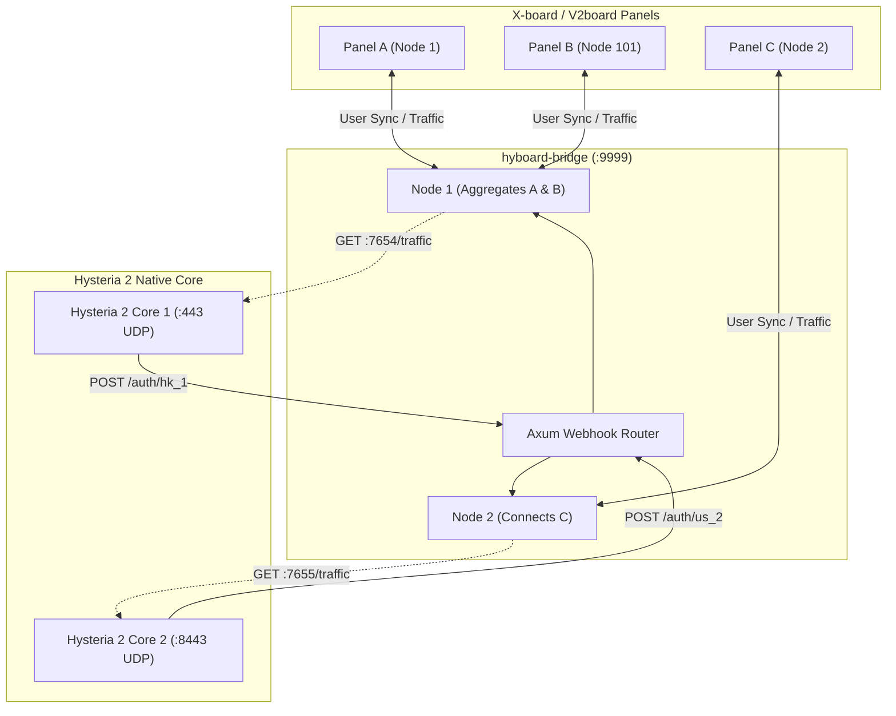

<div align="center">
  <h1>hyboard-bridge</h1>
  <p><strong>Authentication & Traffic Bridge for X-board / V2board to Hysteria 2</strong></p>
  
  <p>
    <a href="README.md">English</a> | 
    <a href="README_zh.md">简体中文</a> | 
    <a href="README_jp.md">日本語</a> | 
    <a href="README_kr.md">한국어</a>
  </p>

  <p>
    <a href="https://github.com/cedar2025/Xboard"></a>
    <a href="https://github.com/v2board/v2board"></a>
    <a href="https://github.com/apernet/hysteria"></a>
  </p>

  <p>
    
    
    
    
    
  </p>
</div>

---

## Overview

`hyboard-bridge` is a high-performance bridge daemon designed for **X-board / V2board** and the **Hysteria 2 Native Core (v2.12+)**.

By exposing a local HTTP Webhook authentication interface and periodically polling the `trafficStats` API, it provides microsecond-level authentication responses and accurate traffic reporting for official Hysteria 2 nodes. It natively supports complex multi-node and cross-panel aggregation architectures.

---

## Features

- **Microsecond Local Auth**: Provides a local `POST /auth` Webhook authentication interface with `< 1ms` response time.
- **Offline Disaster Recovery**: Authentication whitelists reside in memory. Temporary panel downtime will not affect existing connections or new handshakes.
- **Persistent Traffic Reporting**: Automatically accumulates user traffic during network anomalies and reports it upon recovery, ensuring precise billing.
- **Multi-Node Aggregation**: A single Hysteria 2 process can simultaneously authenticate for multiple panels and nodes, automatically aggregating whitelists.
- **Minimal Resource Overhead**: Built on Rust and the Tokio runtime, the binary size is `< 15MB` with static memory consumption `< 10MB`.

---

## Architecture



---

## Configuration (`config.toml`)

Default path: `./config.toml`. Overridable via the `CONFIG_FILE` environment variable.

```toml
[global]
listen_port = 9999              # Local webhook listen port
rust_log = "info"               # Log level (debug, info, warn, error)

# Group 1: Multi-panel aggregation sharing one Hysteria 2 instance (Port 7654)
[[nodes]]
tag = "hk_panel_a"                              # Webhook route: /auth/hk_panel_a
api_host = "https://xboard-a.example.com"
api_key = "token_for_panel_a"
node_id = 1
hysteria_base_url = "http://127.0.0.1:7654"     # Hysteria 2 traffic API
sync_interval = 15                              # Whitelist sync interval (sec)
push_interval = 60                              # Traffic push interval (sec)

[[nodes]]
tag = "hk_panel_b"                              # Webhook route: /auth/hk_panel_b
api_host = "https://xboard-b.example.com"
api_key = "token_for_panel_b"
node_id = 101
hysteria_base_url = "http://127.0.0.1:7654"     
sync_interval = 15
push_interval = 60

# Group 2: Independent Hysteria 2 instance (Port 7655)
[[nodes]]
tag = "us_node"                                 # Webhook route: /auth/us_node
api_host = "https://xboard-a.example.com"
api_key = "token_for_panel_a"
node_id = 2
hysteria_base_url = "http://127.0.0.1:7655"
sync_interval = 15
push_interval = 60
```

---

## Deployment

### 1. Compile & Install
```bash
# 1. Install Rust toolchain
curl --proto '=https' --tlsv1.2 -sSf https://sh.rustup.rs | sh

# 2. Compile project
git clone https://github.com/aquamarine-z/hyboard-bridge.git
cd hyboard-bridge
cargo build --release

# 3. Install binary & config
cp target/release/hyboard-bridge /usr/local/bin/
chmod +x /usr/local/bin/hyboard-bridge
mkdir -p /opt/hyboard-bridge
cp config.example.toml /opt/hyboard-bridge/config.toml
```

### 2. Systemd Service
Create `/etc/systemd/system/hyboard-bridge.service`:
```ini
[Unit]
Description=hyboard-bridge Daemon
After=network.target network-online.target
Wants=network-online.target

[Service]
Type=simple
WorkingDirectory=/opt/hyboard-bridge
ExecStart=/usr/local/bin/hyboard-bridge
Restart=always
RestartSec=3s
LimitNOFILE=65535

[Install]
WantedBy=multi-user.target
```
```bash
systemctl daemon-reload
systemctl enable --now hyboard-bridge
```

---

## Troubleshooting

### 1. TOML Parse Error (`TOML parse error`)
- **Error**: `expected newline, #`
- **Cause**: TOML requires string values to be quoted.
- **Solution**: Ensure properties like `rust_log = "info"` have double quotes.

### 2. Systemd Start Failure (`status=203/EXEC`)
- **Cause**: Incorrect binary path or lacking execution permissions.
- **Solution**: Verify the path `/usr/local/bin/hyboard-bridge` and run `chmod +x`.

### 3. Port Conflict (`bind: address already in use`)
- **Cause**: UDP port occupied by other services (e.g., old Docker instances, XrayR).
- **Solution**: Run `ss -tulpn | grep <PORT>` to find and terminate conflicting processes.

### 4. Client Persistent `Timeout`
- **Cause 1 (Obfs Mismatch)**: Server enabled `obfs`, but client didn't configure the matching password. Hysteria 2 will silently drop packets.
- **Cause 2 (SNI Mismatch)**: The client's requested SNI does not match the server's TLS certificate.
- **Cause 3 (Firewall)**: Cloud security groups or iptables have not allowed the target UDP port.

---

## Hysteria 2 Core Example (`server.yaml`)

```yaml
listen: :443

tls:
  cert: /etc/hysteria/certs/server.crt
  key: /etc/hysteria/certs/server.key

# Salamander Obfuscation (Optional)
obfs:
  type: salamander
  salamander:
    password: your_obfs_password

# Webhook Auth (Bridge binding)
auth:
  type: http
  http:
    # Append tag as defined in config.toml: http://127.0.0.1:9999/auth/hk_panel_a
    # Or default for single-node: http://127.0.0.1:9999/auth
    url: http://127.0.0.1:9999/auth

# Traffic Stats API (Pulled by bridge)
trafficStats:
  listen: 127.0.0.1:7654

acl:
  inline:
    - direct(all)
```

---

## License
This project is licensed under the [MIT License](LICENSE).
