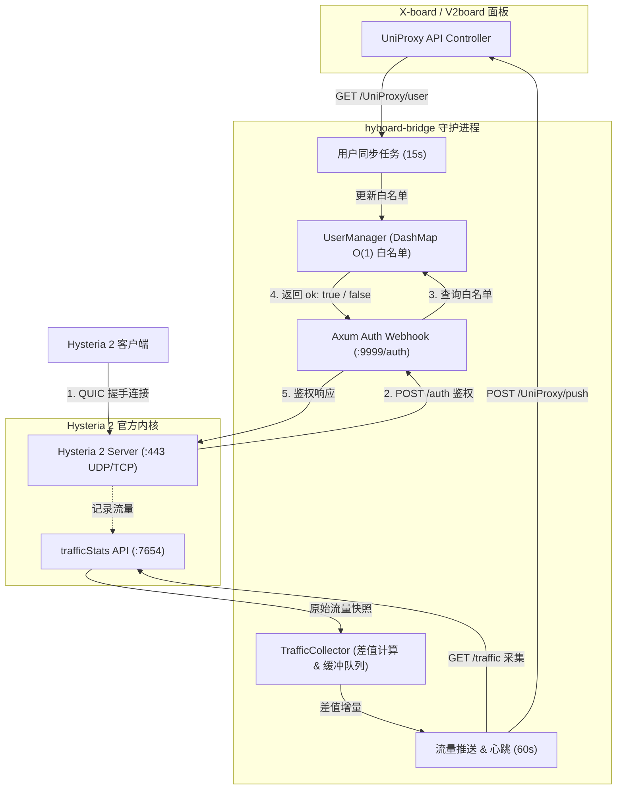

# hyboard-bridge

<p align="center">
  <strong>基于 Rust Tokio / Axum 的工业级高性能 X-board / V2board 与 Hysteria 2 官方内核桥接守护套件</strong>
</p>

<p align="center">
  
  
  
  
  
  
</p>

---

## 📖 项目简介

`hyboard-bridge` 专为 **X-board / V2board** 面板与 **Hysteria 2 官方原生核心 (v2.12+)** 深度适配打造。作为两者的桥接控制中枢，它通过 $O(1)$ 无锁内存哈希表提供微秒级鉴权响应，并实现了精准的增量流量上报、掉线续传缓冲与节点在线心跳维持。

---

## 🌟 核心特性

- **⚡ 微秒级无锁内存鉴权**：
  采用并发数据结构 `DashMap` 构建 $O(1)$ 内存白名单，Axum 异步 Webhook 处理 Hysteria 2 `POST /auth` 请求，支持万级高并发长短连接瞬间握手。
- **📊 精准增量流量上报与抗重启**：
  实时对接 Hysteria 2 `trafficStats` 接口计算 Tx/Rx 增量，自动识别内核重启/计数器重置状态，精准映射面板用户 ID。
- **🛡️ 零丢包容灾与断网缓冲机制**：
  面板短时间宕机或网络波动时，自动保留最后一次用户白名单快照；未成功上报的流量暂存于内存缓冲队列，网络恢复后自动累积续传，杜绝漏计费。
- **🐳 极简容器化交付**：
  基于 Rust Alpine 多阶段静态编译，构建出的最终 Docker 镜像体积 **`< 15MB`**，运行时内存占用 **`< 10MB`**。

---

## 🏗️ 系统架构设计



---

## ⚙️ 环境变量与配置参数

| 变量名 | 必填 | 默认值 | 说明与示例 |
| :--- | :---: | :---: | :--- |
| `API_HOST` | **是** | - | 面板地址，如 `https://panel.example.com` |
| `API_KEY` / `TOKEN` | **是** | - | X-board 面板中的通讯密钥 (UniProxy Token) |
| `NODE_ID` | **是** | - | 面板中分配的节点 ID（整数，如 `1`） |
| `LISTEN_PORT` | 否 | `9999` | **本程序（hyboard-bridge）鉴权服务监听端口** |
| `HYSTERIA_BASE_URL` | **是** | - | **Hysteria 2 官方内核 Base URL（不含子路径）**<br>• 单机部署：`http://127.0.0.1:7654`<br>• Docker 编排：`http://hysteria:7654` |
| `NODE_TYPE` | 否 | `hysteria` | 节点类型 |
| `SYNC_INTERVAL` | 否 | `15` | 用户白名单同步周期（秒） |
| `PUSH_INTERVAL` | 否 | `60` | 流量上报与心跳周期（秒） |
| `RUST_LOG` | 否 | `info` | 日志级别（`trace`, `debug`, `info`, `warn`, `error`） |

---

## 📄 Hysteria 2 官方内核配置示例 (`server.yaml`)

在使用 `hyboard-bridge` 时，您的 Hysteria 2 官方内核仅需配置 `auth.http` 和 `trafficStats` 对接 bridge：

```yaml
# 监听端口
listen: :443

# TLS 证书
tls:
  cert: /etc/hysteria/certs/server.crt
  key: /etc/hysteria/certs/server.key

# Salamander 混淆（可选，建议开启）
obfs:
  type: salamander
  salamander:
    password: your_salamander_password

# HTTP 鉴权对接 hyboard-bridge (端口对应 LISTEN_PORT，默认 9999)
auth:
  type: http
  http:
    url: http://hyboard-bridge:9999/auth  # Docker 容器互联；单机部署填 http://127.0.0.1:9999/auth

# 流量统计接口供 hyboard-bridge 采集 (端口对应 HYSTERIA_BASE_URL，默认 7654)
trafficStats:
  listen: 0.0.0.0:7654                   # 单机部署可填 127.0.0.1:7654

# 伪装网站（可选）
masquerade:
  type: proxy
  proxy:
    url: https://news.ycombinator.com
    rewriteHost: true
```

---

## 🚀 快速开始与部署

### 方式一：Docker Compose 一键部署（推荐）

#### 1. 准备目录结构与证书
```bash
mkdir -p /opt/hyboard && cd /opt/hyboard
mkdir -p certs
# 放入 ./certs/server.crt, ./certs/server.key 及 ./server.yaml
```

#### 2. 配置 `.env` 环境变量
创建并编辑 `.env`：
```bash
cat << 'EOF' > .env
API_HOST=https://panel.example.com
API_KEY=your_uniproxy_token_here
NODE_ID=1
LISTEN_PORT=9999
HYSTERIA_BASE_URL=http://hysteria:7654
EOF
```

#### 3. 编写 `docker-compose.yml`
```yaml
version: '3.8'

services:
  hyboard-bridge:
    image: ghcr.io/yourusername/hyboard-bridge:latest
    # 或本地构建: build: .
    container_name: hyboard-bridge
    restart: unless-stopped
    env_file:
      - .env
    environment:
      - RUST_LOG=info
      - LISTEN_PORT=9999
      - HYSTERIA_BASE_URL=http://hysteria:7654
    networks:
      - hyboard-net

  hysteria:
    image: apernet/hysteria:latest
    container_name: hysteria-core
    restart: unless-stopped
    command: ["server", "-c", "/etc/hysteria/server.yaml"]
    volumes:
      - ./server.yaml:/etc/hysteria/server.yaml:ro
      - ./certs:/etc/hysteria/certs:ro
    ports:
      - "443:443/udp"
      - "443:443/tcp"
    networks:
      - hyboard-net
    depends_on:
      - hyboard-bridge

networks:
  hyboard-net:
    driver: bridge
```

#### 4. 启动服务
```bash
docker compose up -d
docker compose logs -f
```

---

### 方式二：本地 Rust 原生构建与运行

#### 1. 编译
```bash
# 静态极速编译（开启 LTO 与体积优化）
cargo build --release
```
编译产物位于 `target/release/hyboard-bridge`。

#### 2. 运行
```bash
cp .env.example .env
# 编辑配置
nano .env

./target/release/hyboard-bridge
```

---

## 📋 X-board 面板配置指南

在 X-board / V2board 后台添加或配置 Hysteria 节点：

1. **节点类型**：选择 `Hysteria`（或 `Hysteria 2`）；
2. **节点地址**：填写您的服务器解析域名（如 `hy2.yourdomain.com`）；
3. **连接端口**：填写 `443`（或对应监听端口）；
4. **混淆设置**：
   - 混淆协议：`salamander`
   - 混淆密码：填写与 `server.yaml` 中完全一致的密码；
5. **TLS 设置**：
   - Server Name (SNI)：填写您的证书域名；
   - 允许不安全证书：若为正式 Let's Encrypt 证书请填 `false`；
6. 保存后在用户端导入订阅即可极速连接！

---

## ⚡ Linux 系统级 UDP 与 QUIC 网络调优

为了发挥 Hysteria 2 与 `hyboard-bridge` 的极致性能，建议在宿主机执行以下内核参数优化：

```bash
cat << 'EOF' >> /etc/sysctl.d/99-hysteria.conf
# 增加网络缓冲区大小 (针对高带宽 UDP/QUIC)
net.core.rmem_max = 67108864
net.core.wmem_max = 67108864
net.core.rmem_default = 33554432
net.core.wmem_default = 33554432

# 启用 BBR 拥塞控制
net.core.default_qdisc = fq
net.ipv4.tcp_congestion_control = bbr

# 提升连接队列深度
net.core.somaxconn = 65535
net.ipv4.udp_rmem_min = 8192
net.ipv4.udp_wmem_min = 8192
EOF

sysctl --system
```

---

## 🧪 单元测试与代码质量

```bash
cargo test --verbose
```

---

## 📄 License

本项目采用最宽松友好的开源许可证：
- [MIT License](LICENSE)
