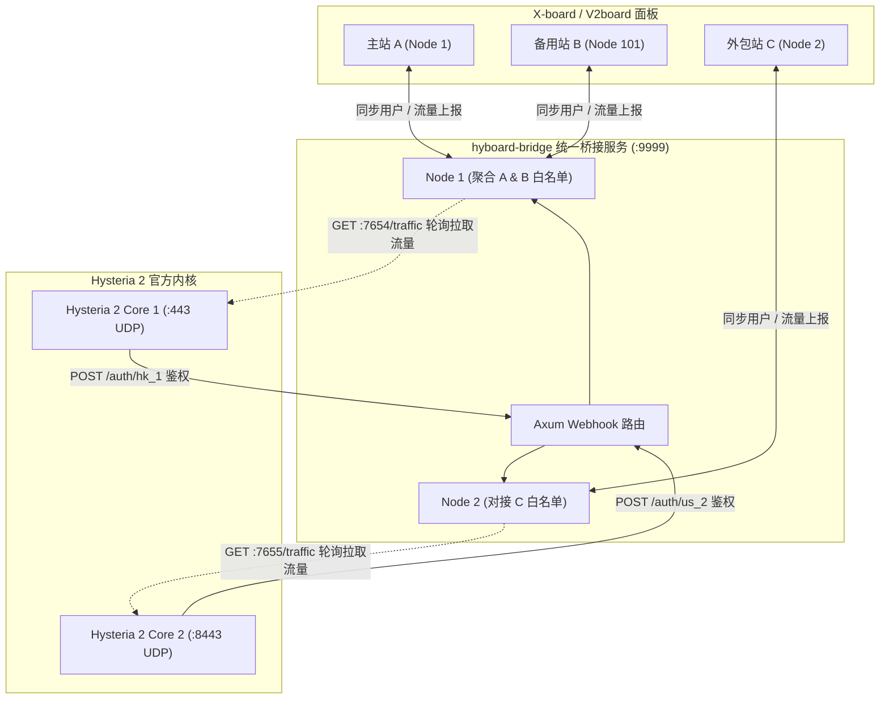

# hyboard-bridge

<p align="center">
  <strong>🚀 Rust Tokio / Axum 编写的工业级 X-board / V2board 面板与 Hysteria 2 官方内核桥接程序</strong>
</p>

<p align="center">
  
  
  
  
  
  
</p>

---

## ✨ 核心特性

`hyboard-bridge` 专为 **X-board / V2board** 和 **Hysteria 2 官方原版内核 (v2.12+)** 设计。

作为中间层，它不仅支持单节点极简部署，还原生支持 **多节点同时服务** 和 **跨面板复用节点** 的企业级架构，提供微秒级本地鉴权与精准的流量计费统计。

---

## ⚡ 架构优势

- **🚀 零延迟本地鉴权**：
  将 Hysteria 2 节点鉴权端口开放到本地，鉴权时延从异地面板的 150ms 缩减到 **< 1ms**，极速响应握手。
- **🛡️ 无惧面板宕机**：
  鉴权白名单定期拉取并缓存至本地内存。即使面板意外宕机或网络中断，已存在用户的代理连接和重新握手完全不受影响！
- **🔄 智能流量补偿计费**：
  网络断开或面板离线期间，用户的流量记录会被桥接程序妥善持久化存储。当面板恢复上线时，所有积累的流量会被完美上报，**彻底告别吞流量/漏计费**。
- **🔌 原生多节点 / 跨面板合流架构**：
  您可以在同一台服务器上：
  1. 运行 **1 个 Hysteria 2 官方内核**（一个端口）；
  2. 让这个节点同时为 **Panel A**（如香港组）和 **Panel B**（如美国组）服务；
  3. 桥接程序会自动合并来自不同面板的用户白名单，为 Hysteria 提供一个统一的超高速本地 HTTP 鉴权接口！

---

## 🏗️ 系统架构图



---

## 🛠️ 配置说明 (`config.toml`)

强烈建议使用 `config.toml` 进行多节点配置。

```toml
[global]
listen_port = 9999              # 本地 Webhook 统一鉴权端口
rust_log = "info"               # 日志级别

# ------------------------------------------------------------------------------
# 组一：复用同一个 Hysteria 2 节点（7654端口），同时服务主站和备站
# ------------------------------------------------------------------------------
[[nodes]]
tag = "hk_panel_a"                              # 对应 Webhook 路由: /auth/hk_panel_a
api_host = "https://xboard-a.example.com"       # 面板 A 地址
api_key = "token_for_panel_a"                   # 面板 A 通讯密钥
node_id = 1                                     # 面板 A 的节点 ID
hysteria_base_url = "http://127.0.0.1:7654"     # Hysteria 2 流量接口
sync_interval = 15                              # 用户同步间隔(秒)
push_interval = 60                              # 流量上报间隔(秒)

[[nodes]]
tag = "hk_panel_b"                              # 对应 Webhook 路由: /auth/hk_panel_b
api_host = "https://xboard-b.example.com"       # 面板 B 地址
api_key = "token_for_panel_b"                   # 面板 B 通讯密钥
node_id = 101                                   # 面板 B 的节点 ID
hysteria_base_url = "http://127.0.0.1:7654"     # 指向同一个 Hysteria 实例自动聚合用户
sync_interval = 15
push_interval = 60

# ------------------------------------------------------------------------------
# 组二：同服务器上的另一个 Hysteria 2 节点（7655端口）
# ------------------------------------------------------------------------------
[[nodes]]
tag = "us_node"                                 # 对应 Webhook 路由: /auth/us_node
api_host = "https://xboard-a.example.com"
api_key = "token_for_panel_a"
node_id = 2
hysteria_base_url = "http://127.0.0.1:7655"
sync_interval = 15
push_interval = 60
```

---

## 🚀 部署指南 (Deployment Guide)

### 1. 编译安装
```bash
# 1. 安装 Rust 工具链
curl --proto '=https' --tlsv1.2 -sSf https://sh.rustup.rs | sh

# 2. 拉取代码并编译
git clone https://github.com/aquamarine-z/hyboard-bridge.git
cd hyboard-bridge
cargo build --release

# 3. 安装到系统路径
cp target/release/hyboard-bridge /usr/local/bin/
chmod +x /usr/local/bin/hyboard-bridge
mkdir -p /opt/hyboard-bridge
cp config.example.toml /opt/hyboard-bridge/config.toml
```

### 2. Systemd 守护进程
创建 `/etc/systemd/system/hyboard-bridge.service`：
```ini
[Unit]
Description=hyboard-bridge Daemon
After=network.target network-online.target
Wants=network-online.target

[Service]
Type=simple
WorkingDirectory=/opt/hyboard-bridge
ExecStart=/usr/local/bin/hyboard-bridge
Restart=always
RestartSec=3s
LimitNOFILE=65535

[Install]
WantedBy=multi-user.target
```
```bash
systemctl daemon-reload
systemctl enable hyboard-bridge
systemctl start hyboard-bridge
```

---

## ⚠️ 部署避坑指南 (Troubleshooting)

在实际部署与运维中，您可能会遇到以下常见坑点，请对照检查：

### 1. 启动失败: `TOML parse error` 
如果在日志中看到类似 `TOML parse error at line 3: expected newline, #` 的错误：
- **原因**：TOML 配置文件对数据类型非常严格。如果是字符串类型，**必须加上双引号**。
- **解决**：检查 `config.toml`。错误写法：`rust_log = info`。正确写法：`rust_log = "info"`。

### 2. 启动失败: `status=203/EXEC`
如果在 `systemctl status hyboard-bridge` 看到 `status=203/EXEC` 或 `No such file or directory`：
- **原因**：Systemd 服务文件（`.service`）中的 `ExecStart` 路径错误，或该路径下的文件没有执行权限。
- **解决**：确认二进制文件路径（如 `/usr/local/bin/hyboard-bridge`），并确保已执行 `chmod +x /usr/local/bin/hyboard-bridge` 赋予执行权限。

### 3. Hysteria 报错: `bind: address already in use`
- **原因**：目标端口（如 UDP `50001`）已被其他进程占用。最常见的情况是服务器上残留了旧的 Hysteria Docker 容器（尤其使用了 `--net=host`），或者有重复冲突的 Systemd 服务（如 `hysteria.service` 和 `hysteria-50001.service` 同时运行）。
- **解决**：使用 `ss -tulpn | grep 50001` 找出占用端口的进程（如 Docker 容器、其他面板后端或 `XrayR`），停止并清理冲突进程。

### 4. 客户端连接 Hysteria 始终报 `Timeout` (超时)
如果服务已正常启动运行，但手机/电脑端连接始终 Timeout，请重点排查：
- **混淆 (Obfs) 设置不匹配**：如果服务器的 Hysteria 配置文件中开启了混淆（如 `salamander`），而客户端节点没有配置或密码填错，Hysteria 官方内核为了防主动探测会**直接静默丢包**，导致客户端显示超时。
- **SNI 域名不匹配**：客户端填写的服务器地址或 SNI 必须与服务器端证书文件 (`fullchain.pem`) 所绑定的域名（如 `node-tokyo-01.domain.com`）完全一致。
- **防火墙规则**：确保服务器的防火墙（UFW/iptables）以及云服务商的安全组放行了对应的 **UDP** 端口（注意不是 TCP）。

---

## ⚙️ Hysteria 2 官方内核配置示例 (`server.yaml`)

```yaml
listen: :443

tls:
  cert: /etc/hysteria/certs/server.crt
  key: /etc/hysteria/certs/server.key

# Salamander 混淆（选填）
obfs:
  type: salamander
  salamander:
    password: your_password

# HTTP 鉴权对接 hyboard-bridge
auth:
  type: http
  http:
    # 多节点模式可带 tag: http://127.0.0.1:9999/auth/hk_panel_a
    # 单节点直接填: http://127.0.0.1:9999/auth
    url: http://127.0.0.1:9999/auth

# 流量统计接口供 bridge 拉取
trafficStats:
  listen: 127.0.0.1:7654

acl:
  inline:
    - direct(all)
```

---

## 🧪 单元测试

```bash
cargo test --verbose
```

---

## 📄 License

本项目采用 MIT 协议开源。
- [MIT License](LICENSE)
