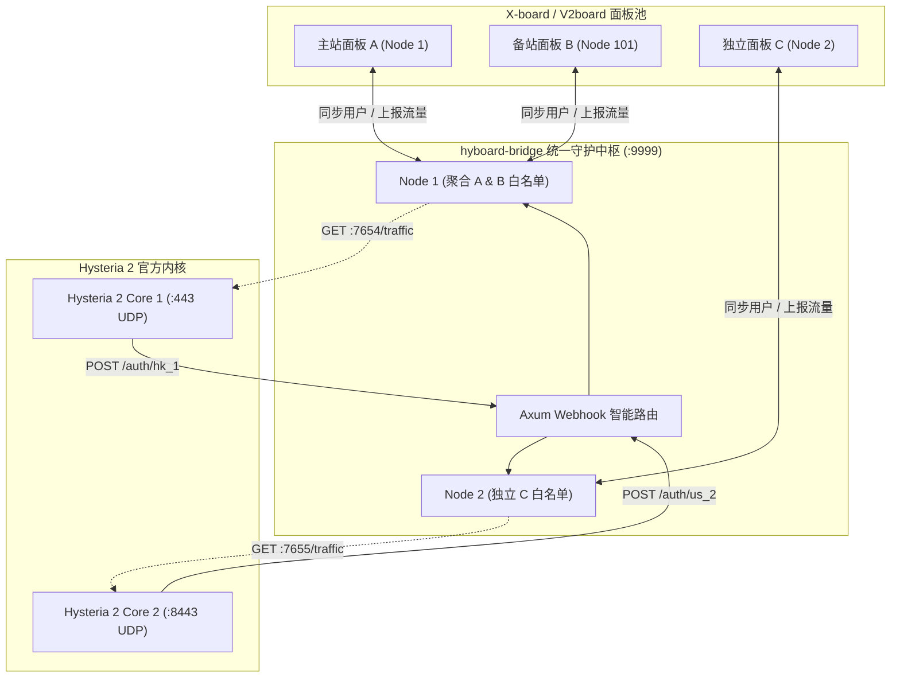

# hyboard-bridge

<p align="center">
  <strong>基于 Rust Tokio / Axum 的工业级高性能 X-board / V2board 多节点与多面板 Hysteria 2 桥接守护套件</strong>
</p>

<p align="center">
  
  
  
  
  
  
</p>

---

## 📖 项目简介

`hyboard-bridge` 专为 **X-board / V2board** 面板与 **Hysteria 2 官方原生核心 (v2.12+)** 深度适配打造。

作为高性能桥接中枢，它不仅支持单节点极简部署，还原生支持 **「单节点同时服务多个面板」** 与 **「单守护进程集中管理多个独立节点」** 的矩阵架构，提供微秒级无锁内存鉴权、精准增量流量分账上报以及节点在线心跳维持。

---

## 🌟 核心特性

- **⚡ 多面板聚合与微秒级鉴权**：
  单个 Hysteria 2 节点端口可同时接入多个不同面板，用户白名单在内存中自动聚合检索（$O(1)$ 复杂度），任意面板的用户均可无感接入。
- **📊 跨面板精准流量分账**：
  从 Hysteria 2 采集流量后，依据用户归属的面板与 `node_id` 自动精准分流上报，绝不串账，各面板独立维持在线心跳。
- **🏢 单进程多节点纳管**：
  一台服务器上的多个 Hysteria 2 实例（不同端口）由一个轻量 `hyboard-bridge` 进程统一管理调度，资源占用极低。
- **🛡️ 零丢包容灾与断网缓冲机制**：
  某面板短时间宕机时，自动保留最后一次白名单快照，未成功推送的流量在内存缓冲队列中排队，面板恢复后自动续传。
- **🐳 极简容器化交付**：
  基于 Rust Alpine 多阶段静态编译，构建出的最终 Docker 镜像体积 **`< 15MB`**，运行时内存占用 **`< 10MB`**。

---

## 🏗️ 系统拓扑架构



---

## ⚙️ 配置文件说明 (`config.toml`)

推荐使用 `config.toml` 进行多节点与多面板配置（支持通过环境变量 `CONFIG_FILE=./config.toml` 指定路径）：

```toml
[global]
listen_port = 9999              # 本程序 Webhook 统一鉴权监听端口
rust_log = "info"               # 日志级别

# ------------------------------------------------------------------------------
# 场景一：同一个 Hysteria 2 节点（7654端口），同时服务【主站】和【备站】两个面板
# ------------------------------------------------------------------------------
[[nodes]]
tag = "hk_panel_a"                              # 对应 Webhook 路径: /auth/hk_panel_a
api_host = "https://xboard-a.example.com"       # 面板 A 地址
api_key = "token_for_panel_a"                   # 面板 A 通讯密钥
node_id = 1                                     # 面板 A 里的节点 ID
hysteria_base_url = "http://127.0.0.1:7654"     # Hysteria 2 流量接口
sync_interval = 15                              # 用户同步周期(秒)
push_interval = 60                              # 流量推送周期(秒)

[[nodes]]
tag = "hk_panel_b"                              # 对应 Webhook 路径: /auth/hk_panel_b
api_host = "https://xboard-b.example.com"       # 面板 B 地址
api_key = "token_for_panel_b"                   # 面板 B 通讯密钥
node_id = 101                                   # 面板 B 里的节点 ID
hysteria_base_url = "http://127.0.0.1:7654"     # 指向同一个 Hysteria 实例（自动聚合用户与分流流量）
sync_interval = 15
push_interval = 60

# ------------------------------------------------------------------------------
# 场景二：同一台机器上的另一个独立 Hysteria 2 节点（7655端口）
# ------------------------------------------------------------------------------
[[nodes]]
tag = "us_node"                                 # 对应 Webhook 路径: /auth/us_node
api_host = "https://xboard-a.example.com"
api_key = "token_for_panel_a"
node_id = 2
hysteria_base_url = "http://127.0.0.1:7655"
sync_interval = 15
push_interval = 60
```

> **提示**：如果是最基础的单节点单面板部署，亦可直接使用 `.env` 环境变量配置，无需创建 `config.toml`。

---

## 📄 Hysteria 2 官方内核配置对接 (`server.yaml`)

在 Hysteria 2 官方内核配置中，根据节点 tag 或统一路由填写 `auth.http`：

```yaml
listen: :443

tls:
  cert: /etc/hysteria/certs/server.crt
  key: /etc/hysteria/certs/server.key

# Salamander 混淆（可选）
obfs:
  type: salamander
  salamander:
    password: your_salamander_password

# HTTP 鉴权对接 hyboard-bridge
auth:
  type: http
  http:
    # 多节点模式可带 tag: http://hyboard-bridge:9999/auth/hk_panel_a
    # 单节点或共享节点直接填: http://hyboard-bridge:9999/auth
    url: http://hyboard-bridge:9999/auth

# 流量统计接口
trafficStats:
  listen: 0.0.0.0:7654
```

---

## 🚀 快速启动与部署

### 方式一：Docker Compose 部署（推荐）

```bash
mkdir -p /opt/hyboard && cd /opt/hyboard
# 1. 放置 config.toml
cp config.example.toml config.toml
# 2. 放置证书与 server.yaml
# 3. 启动
docker compose up -d
docker compose logs -f
```

---

### 方式二：本地原生构建与运行

```bash
# 1. 编译
cargo build --release

# 2. 启动
./target/release/hyboard-bridge
```

---

## 🧪 单元测试与代码质量

```bash
cargo test --verbose
```

---

## 📄 License

本项目采用最宽松友好的开源许可证：
- [MIT License](LICENSE)
