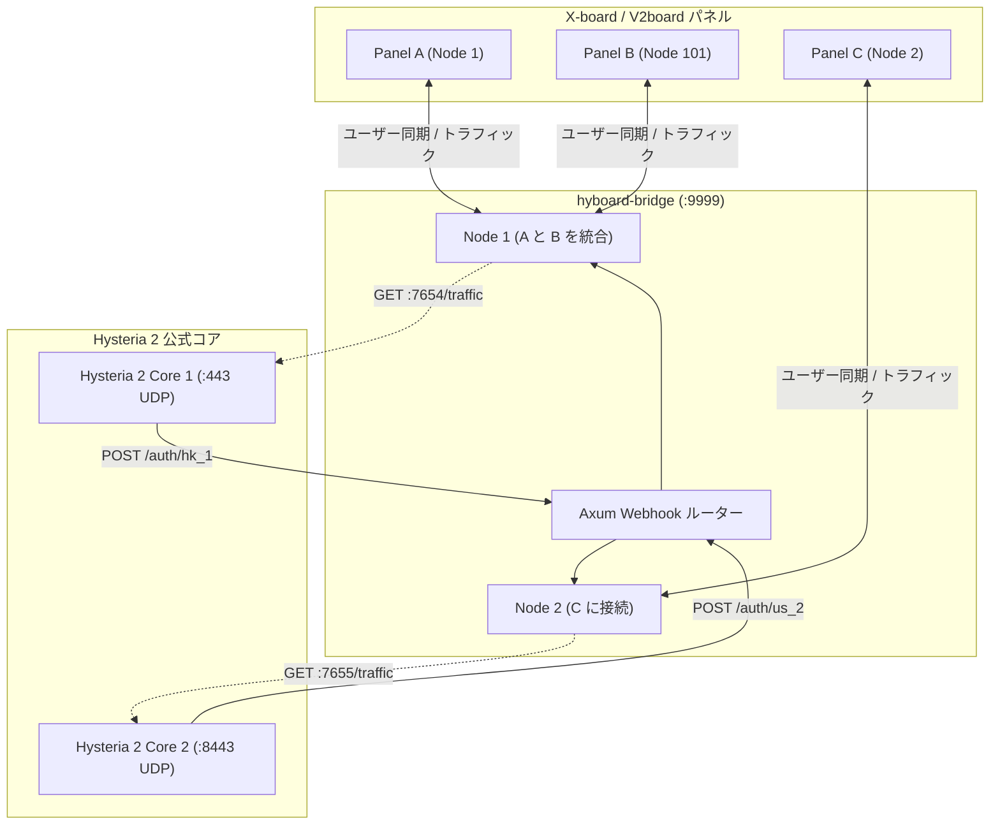

<div align="center">
  <h1>hyboard-bridge</h1>
  <p><strong>X-board / V2board から Hysteria 2 コアへの認証・トラフィックブリッジ</strong></p>
  
  <p>
    <a href="README.md">English</a> | 
    <a href="README_zh.md">简体中文</a> | 
    <a href="README_jp.md">日本語</a> | 
    <a href="README_kr.md">한국어</a>
  </p>

  <p>
    <a href="https://github.com/cedar2025/Xboard"></a>
    <a href="https://github.com/v2board/v2board"></a>
    <a href="https://github.com/apernet/hysteria"></a>
  </p>

  <p>
    
    
    
    
    
  </p>
</div>

---

## 概要 (Overview)

`hyboard-bridge` は、**X-board / V2board** パネルと **Hysteria 2 公式コア (v2.12+)** を接続するために設計された高性能なブリッジデーモンです。

ローカルで HTTP Webhook 認証インターフェースを公開し、定期的に `trafficStats` をポーリングすることで、公式 Hysteria 2 ノードに対してマイクロ秒レベルの認証応答と正確なトラフィック報告を提供します。複雑なマルチノードおよびパネル統合アーキテクチャをネイティブでサポートします。

---

## 主な機能 (Features)

- **マイクロ秒のローカル認証**: `< 1ms` の応答時間を持つローカルの `POST /auth` Webhook 認証インターフェース。
- **オフラインディザスタリカバリ**: 認証ホワイトリストはメモリに保持されます。パネルが一時的にダウンしても、既存の接続や新しいハンドシェイクには影響しません。
- **永続的なトラフィック報告**: ネットワーク異常時にユーザートラフィックを自動的に蓄積し、復旧時に報告することで正確な課金を保証します。
- **マルチノード統合**: 単一の Hysteria 2 プロセスで複数のパネルやノードを同時に認証し、ホワイトリストを自動で集約します。
- **最小限のシステムオーバーヘッド**: Rust と Tokio ランタイムで構築されており、バイナリサイズは `< 15MB`、静的メモリ消費は `< 10MB` です。

---

## アーキテクチャ (Architecture)



---

## 設定ファイル (`config.toml`)

デフォルトのパス: `./config.toml`。`CONFIG_FILE` 環境変数で上書き可能です。

```toml
[global]
listen_port = 9999              # Webhook 待受ポート
rust_log = "info"               # ログレベル (debug, info, warn, error)

# グループ 1: Hysteria 2 インスタンス (7654番ポート) を共有するマルチパネル設定
[[nodes]]
tag = "hk_panel_a"                              # Webhook ルート: /auth/hk_panel_a
api_host = "https://xboard-a.example.com"
api_key = "token_for_panel_a"
node_id = 1
hysteria_base_url = "http://127.0.0.1:7654"     # Hysteria 2 トラフィック API
sync_interval = 15                              # ホワイトリスト同期の同期間隔(秒)
push_interval = 60                              # トラフィックの送信間隔(秒)

[[nodes]]
tag = "hk_panel_b"                              # Webhook ルート: /auth/hk_panel_b
api_host = "https://xboard-b.example.com"
api_key = "token_for_panel_b"
node_id = 101
hysteria_base_url = "http://127.0.0.1:7654"     
sync_interval = 15
push_interval = 60

# グループ 2: 独立した Hysteria 2 インスタンス (7655番ポート)
[[nodes]]
tag = "us_node"                                 # Webhook ルート: /auth/us_node
api_host = "https://xboard-a.example.com"
api_key = "token_for_panel_a"
node_id = 2
hysteria_base_url = "http://127.0.0.1:7655"
sync_interval = 15
push_interval = 60
```

---

## デプロイメント (Deployment)

### 1. コンパイルとインストール
```bash
# 1. Rust ツールチェーンのインストール
curl --proto '=https' --tlsv1.2 -sSf https://sh.rustup.rs | sh

# 2. プロジェクトのコンパイル
git clone https://github.com/aquamarine-z/hyboard-bridge.git
cd hyboard-bridge
cargo build --release

# 3. インストール
cp target/release/hyboard-bridge /usr/local/bin/
chmod +x /usr/local/bin/hyboard-bridge
mkdir -p /opt/hyboard-bridge
cp config.example.toml /opt/hyboard-bridge/config.toml
```

### 2. Systemd サービスの設定
`/etc/systemd/system/hyboard-bridge.service` を作成します：
```ini
[Unit]
Description=hyboard-bridge Daemon
After=network.target network-online.target
Wants=network-online.target

[Service]
Type=simple
WorkingDirectory=/opt/hyboard-bridge
ExecStart=/usr/local/bin/hyboard-bridge
Restart=always
RestartSec=3s
LimitNOFILE=65535

[Install]
WantedBy=multi-user.target
```
```bash
systemctl daemon-reload
systemctl enable --now hyboard-bridge
```

---

## トラブルシューティング (Troubleshooting)

### 1. TOML 構文エラー (`TOML parse error`)
- **原因**: TOML は文字列をダブルクォーテーションで囲む必要があります。
- **解決策**: `rust_log = "info"` のように記述されていることを確認してください。

### 2. サービス起動失敗 (`status=203/EXEC`)
- **原因**: 実行ファイルのパスが誤っているか、実行権限がありません。
- **解決策**: `chmod +x` で権限を付与し、パスを確認してください。

### 3. ポート競合 (`bind: address already in use`)
- **原因**: 指定した UDP ポートが他のプロセスによって既に使用されています。
- **解決策**: `ss -tulpn | grep <PORT>` を使用してプロセスを特定し、終了させてください。

### 4. クライアントの永続的なタイムアウト (`Timeout`)
- **原因 1**: サーバーで `obfs` が有効になっているが、クライアント側でパスワードが設定されていない場合、Hysteria 2 はパケットを無視します。
- **原因 2**: クライアントの SNI がサーバーの TLS 証明書と一致していません。
- **原因 3**: ファイアウォールで UDP ポートがブロックされています。

---

## Hysteria 2 構成例 (`server.yaml`)

```yaml
listen: :443

tls:
  cert: /etc/hysteria/certs/server.crt
  key: /etc/hysteria/certs/server.key

obfs:
  type: salamander
  salamander:
    password: your_obfs_password

auth:
  type: http
  http:
    url: http://127.0.0.1:9999/auth

trafficStats:
  listen: 127.0.0.1:7654

acl:
  inline:
    - direct(all)
```

---

## ライセンス
このプロジェクトは [MIT License](LICENSE) の下でライセンスされています。
