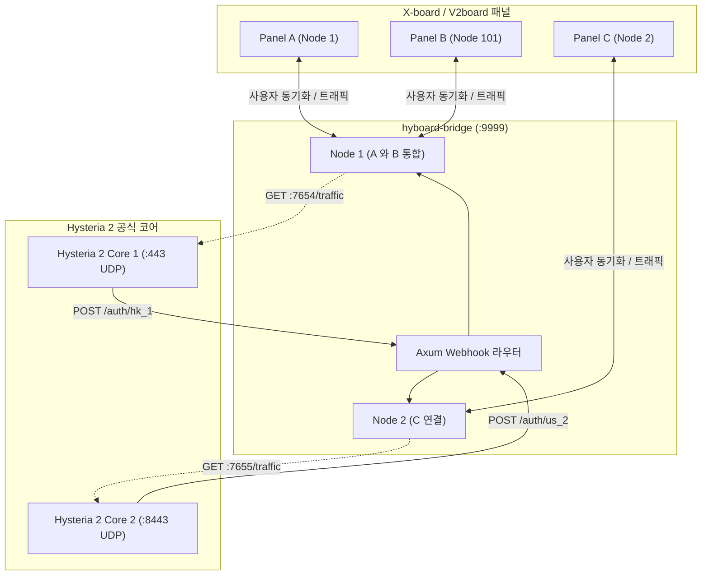

<div align="center">
  <h1>hyboard-bridge</h1>
  <p><strong>X-board / V2board 및 Hysteria 2 공식 코어를 위한 인증 및 트래픽 브릿지</strong></p>
  
  <p>
    <a href="README.md">English</a> | 
    <a href="README_zh.md">简体中文</a> | 
    <a href="README_jp.md">日本語</a> | 
    <a href="README_kr.md">한국어</a>
  </p>

  <p>
    <a href="https://github.com/cedar2025/Xboard"></a>
    <a href="https://github.com/v2board/v2board"></a>
    <a href="https://github.com/apernet/hysteria"></a>
  </p>

  <p>
    
    
    
    
    
  </p>
</div>

---

## 개요 (Overview)

`hyboard-bridge`는 **X-board / V2board**와 **Hysteria 2 공식 코어 (v2.12+)**를 위해 설계된 고성능 브릿지 데몬입니다.

로컬 HTTP Webhook 인증 인터페이스를 열고 `trafficStats` API를 주기적으로 폴링함으로써, 공식 Hysteria 2 노드에 마이크로초 수준의 인증 응답과 정확한 트래픽 보고를 제공합니다. 복잡한 다중 노드 및 패널 통합 아키텍처를 기본적으로 지원합니다.

---

## 주요 기능 (Features)

- **마이크로초 로컬 인증**: `< 1ms` 응답 시간을 갖는 로컬 `POST /auth` Webhook 인증 인터페이스.
- **오프라인 재해 복구**: 인증 화이트리스트가 메모리에 상주합니다. 패널이 일시적으로 다운되더라도 기존 연결 및 새로운 핸드셰이크에 영향을 주지 않습니다.
- **영구적인 트래픽 보고**: 네트워크 이상 중에 사용자 트래픽을 자동으로 누적하고 복구 시 보고하여 정확한 과금을 보장합니다.
- **다중 노드 통합**: 단일 Hysteria 2 프로세스가 여러 패널과 노드를 동시에 인증하며 화이트리스트를 자동으로 통합합니다.
- **최소한의 리소스 오버헤드**: Rust와 Tokio 런타임으로 구축되어 바이너리 크기는 `< 15MB`이며 정적 메모리 소비는 `< 10MB`입니다.

---

## 아키텍처 (Architecture)



---

## 설정 (`config.toml`)

기본 경로: `./config.toml`. `CONFIG_FILE` 환경 변수를 통해 재정의 가능합니다.

```toml
[global]
listen_port = 9999              # 로컬 Webhook 수신 포트
rust_log = "info"               # 로그 레벨 (debug, info, warn, error)

# 그룹 1: 동일한 Hysteria 2 인스턴스를 공유하는 다중 패널 설정
[[nodes]]
tag = "hk_panel_a"                              # Webhook 경로: /auth/hk_panel_a
api_host = "https://xboard-a.example.com"
api_key = "token_for_panel_a"
node_id = 1
hysteria_base_url = "http://127.0.0.1:7654"     # Hysteria 2 트래픽 API
sync_interval = 15                              # 화이트리스트 동기화 간격(초)
push_interval = 60                              # 트래픽 보고 간격(초)

[[nodes]]
tag = "hk_panel_b"                              # Webhook 경로: /auth/hk_panel_b
api_host = "https://xboard-b.example.com"
api_key = "token_for_panel_b"
node_id = 101
hysteria_base_url = "http://127.0.0.1:7654"     
sync_interval = 15
push_interval = 60

# 그룹 2: 독립적인 Hysteria 2 인스턴스
[[nodes]]
tag = "us_node"                                 # Webhook 경로: /auth/us_node
api_host = "https://xboard-a.example.com"
api_key = "token_for_panel_a"
node_id = 2
hysteria_base_url = "http://127.0.0.1:7655"
sync_interval = 15
push_interval = 60
```

---

## 배포 (Deployment)

### 1. 컴파일 및 설치
```bash
# 1. Rust 도구 모음 설치
curl --proto '=https' --tlsv1.2 -sSf https://sh.rustup.rs | sh

# 2. 프로젝트 컴파일
git clone https://github.com/aquamarine-z/hyboard-bridge.git
cd hyboard-bridge
cargo build --release

# 3. 설치
cp target/release/hyboard-bridge /usr/local/bin/
chmod +x /usr/local/bin/hyboard-bridge
mkdir -p /opt/hyboard-bridge
cp config.example.toml /opt/hyboard-bridge/config.toml
```

### 2. Systemd 서비스
`/etc/systemd/system/hyboard-bridge.service` 생성:
```ini
[Unit]
Description=hyboard-bridge Daemon
After=network.target network-online.target
Wants=network-online.target

[Service]
Type=simple
WorkingDirectory=/opt/hyboard-bridge
ExecStart=/usr/local/bin/hyboard-bridge
Restart=always
RestartSec=3s
LimitNOFILE=65535

[Install]
WantedBy=multi-user.target
```
```bash
systemctl daemon-reload
systemctl enable --now hyboard-bridge
```

---

## 문제 해결 (Troubleshooting)

### 1. TOML 구문 오류 (`TOML parse error`)
- **원인**: TOML은 문자열 값에 따옴표를 요구합니다.
- **해결책**: `rust_log = "info"`와 같이 큰따옴표가 있는지 확인하세요.

### 2. 시작 실패 (`status=203/EXEC`)
- **원인**: 바이너리 경로가 잘못되었거나 실행 권한이 없습니다.
- **해결책**: 경로를 확인하고 `chmod +x`를 실행하세요.

### 3. 포트 충돌 (`bind: address already in use`)
- **원인**: 다른 서비스가 해당 포트를 점유하고 있습니다.
- **해결책**: `ss -tulpn | grep <PORT>`를 실행하여 충돌 프로세스를 종료하세요.

### 4. 지속적인 타임아웃 (`Timeout`)
- **원인 1**: 서버에 `obfs`가 설정되어 있지만 클라이언트에 비밀번호가 일치하지 않으면 패킷을 자동으로 삭제합니다.
- **원인 2**: 클라이언트의 SNI가 서버의 TLS 인증서와 일치하지 않습니다.
- **원인 3**: 방화벽에서 UDP 포트가 허용되지 않았습니다.

---

## Hysteria 2 설정 예시 (`server.yaml`)

```yaml
listen: :443

tls:
  cert: /etc/hysteria/certs/server.crt
  key: /etc/hysteria/certs/server.key

obfs:
  type: salamander
  salamander:
    password: your_obfs_password

auth:
  type: http
  http:
    url: http://127.0.0.1:9999/auth

trafficStats:
  listen: 127.0.0.1:7654

acl:
  inline:
    - direct(all)
```

---

## 라이선스
이 프로젝트는 [MIT License](LICENSE)를 따릅니다.
